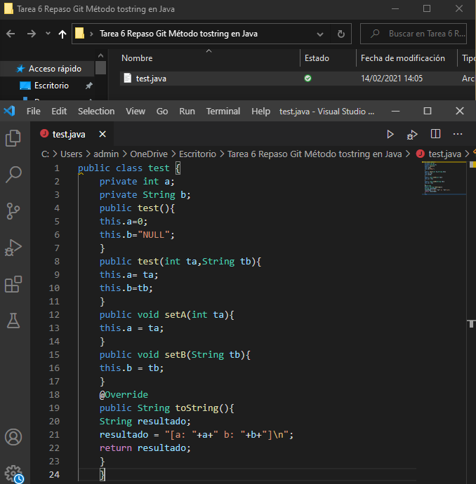
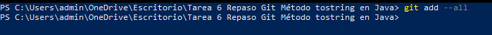
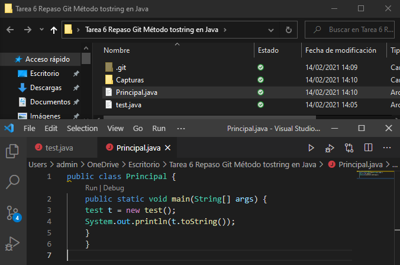
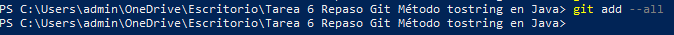
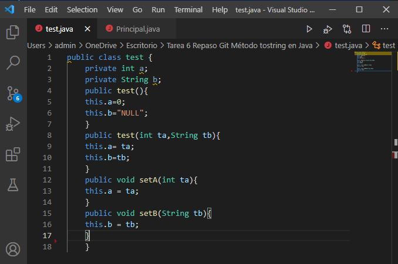
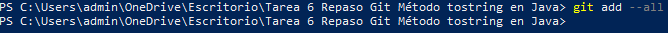
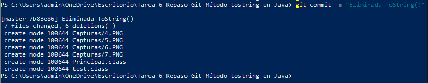
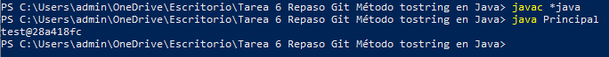
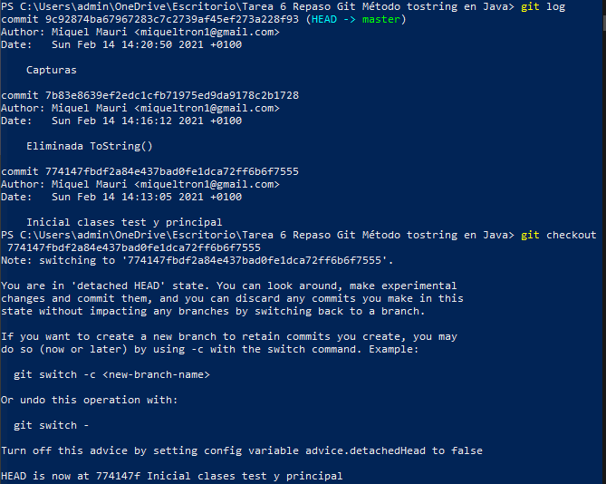

### Tarea 6: Repaso GIT. Método tostring en java
#### 1.  Cread un fichero test.java con la clase test como sigue:  

#### 2. Pasad a preparado el fichero.  

#### 3. Cread el fichero Principal.java  

#### 4. Pasad a preparado el fichero  

#### 5. Haced un commit con el comentario “Inicial clases test y principal”  

#### 6. Comprobad la salida del programa. (debéis compilar los .java y probar el Principal)  

#### 7. Modificad el fichero test eliminando el método toString()  

#### 8. Pasad a preparado el fichero  

#### 9. Realizad un segundo commit “Eliminada ToString()”  

#### 10.  Comprobad de nuevo la salida del programa.  

#### 11. . Volved atrás viendo los “log” y haciendo “checkout” necesarios para que la salida del programa sea la del paso 6. Responded a las preguntas en el markdown: ¿Qué creéis que hace el método toString? Y ¿Qué conseguimos con el @Override?  
  
El método toString devuelve el valor del string resultado.  
Si un método está marcado con @Override debería estar sobreescribiendo un método de alguna clase padre. 

