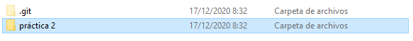
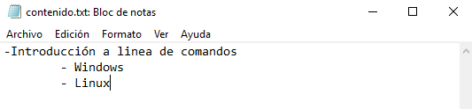
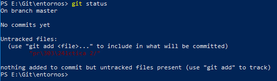
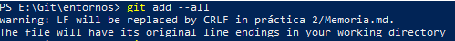
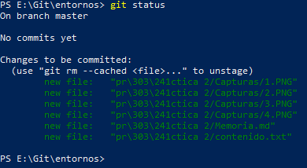
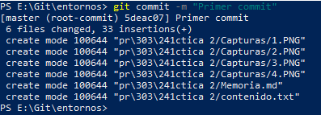
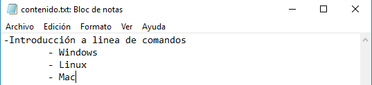
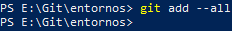
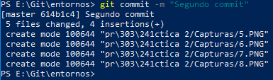
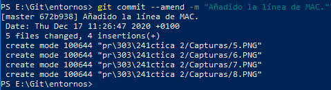

### Práctica 2 - GIT  
1. Crea un repositorio (directorio) llamado practica2git e inicializa el sistema de control de versiones  

2. Crea un fichero llamado contenido.txt con el siguiente texto:  

- Introducción a linea de comandos
    - Windows
    - Linux  

3. Comprueba el estado del repositorio  

4. Añade el fichero a la zona de preparado    

5. Comprueba de nuevo el estado del repositorio  

6. Hacer el primer commit con su comentario correspondiente  

7. Añadir la línea al fichero:

- Mac  

8. Comprueba de nuevo el estado del repositorio  

9. Añadir el fichero a preparado  

10. Hacer otro commit del fichero  

11. Cambiar el mensaje del último commit por “Añadido la línea de MAC.”  
Para cambiar el mensaje del commit se usa:  
$git commit --ammend -m "Mensaje"  
