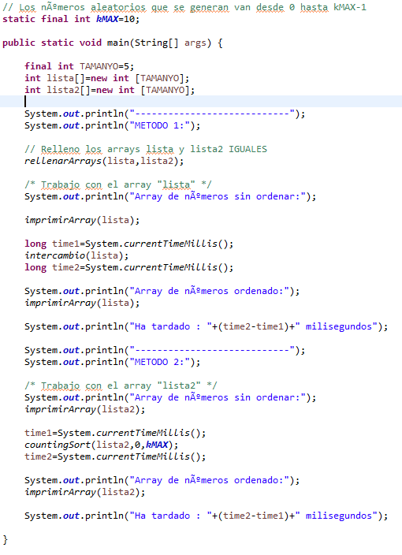
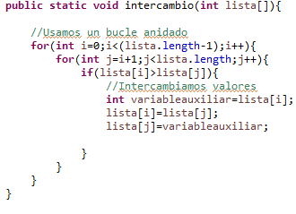
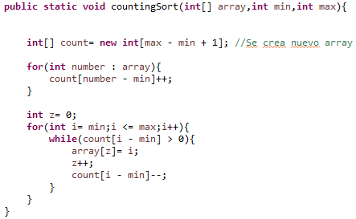

### Tarea 6: Depuración  de un programa para saber que hace
#### 1.  Explicar QUÉ HACE EL MÉTODO MAIN.  
  
Crea dos arrays de tamaño TAMANYO, llena estos arrays con números aleatorios entre 0 y kMAX.  
La primera lisa se ordena con el método intercambio y se imprime el resultado.
La segunda lista se ordena con el método countingSort y se imprime el resultado.
También se calcula cuanto tardan en ejecutarse los métodos, tomando el tiempo que ha tardado el programa en ejecutarse hasta el punto inmediatamente anterior al método, que se le resta al tiempo tomado tras acabar de ejecutarse el método.  

#### 2. Poner un punto de ruptura (breakpoint) en la línea 78 (primer bucle del método intercambio) y, basándoos en los valores que van tomando las variables, explicad cómo funciona el método de ordenación de arrays por intercambio. Podéis crear tablas para ver cómo cambian los valores de los arrays  

  
  
Se comprueban los valores de las posiciones i y j, si i es mayor que j se intercambiaran sus valores,
j ira incrementando su valor para recorrer todas las posiciones del array, de forma que el valor mas pequeño dentro del array acabará en la posición i, tras esto i incrementara su valor.  
  
Se vuelve a entrar en el bucle j, pero esta vez como i vale 1, no se comprueba la posición 0 del array, de forma que el segundo número mas pequeño se pondrá en la posición 1, este proceso se repetirá hasta que el array este completamente ordenado  
  

#### 3. Poner un punto de ruptura (breakpoint) en la línea 94 y explicad cómo funciona el método de ordenación de arrays de conteo. Podéis crear tablas para ver cómo cambian los valores de los arrays  

  
  
Se crea un nuevo array con tantas posiciones como valores puede tener lista2,
gracias al primer for las posiciones de count correspondientes a los valores de lista2 aumentarán su valor.  
  
el segundo for recorrera el array count de forma que cuando encuentre un valor superior a 0 imprimira el valor de su posición en la posición z de lista2 lo que aumentara el valor de z en 1   1  
cuando se recorra completamente el array, lista2 quedará ordenada de menor a mayor  
